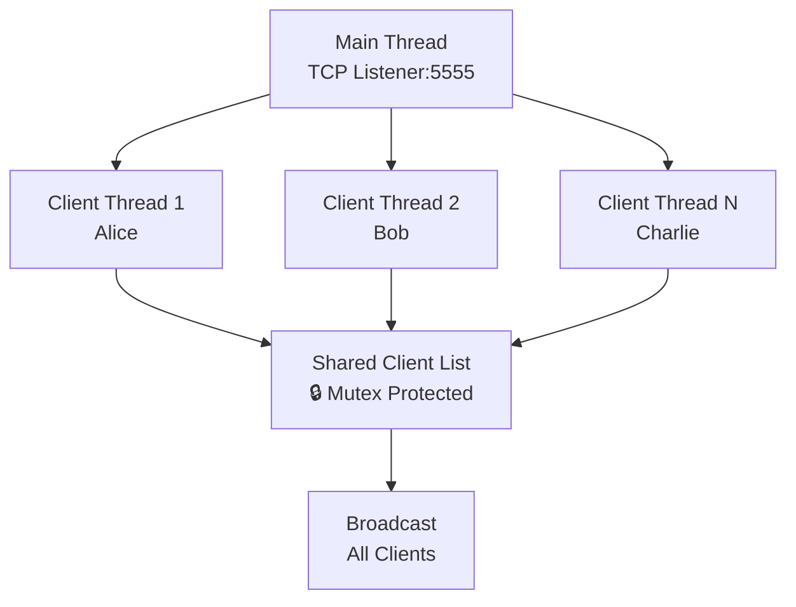

# TerminalTalk TCP Server ✨

<div align="center">
  


<br>

[
[
[
[
[
[

[
[

</div>

***

## 🚀 Features

<div align="center">

| ✨ **Core Features** | 🛠 **Technical** |
|---------------------|------------------|
| ✅ Real-time messaging | 🔒 Thread-safe operations |
| 👥 Unlimited clients | ⚡ Zero dependencies |
| 🆔 Username system | 🧵 Multi-threaded |
| 📢 Broadcast messages | 🔄 Non-blocking I/O |
| 👋 Join/leave notifications | ♻️ Auto cleanup |

</div>

<p align="center">
  
  
  
</p>

***

## 🎯 Quick Start

```bash
# Clone & Build
git clone https://github.com/suadatbiniqbal/TerminalTalk-TCP-Server.git
cd TerminalTalk-TCP-Server
make

# Terminal 1: Server
./server

# Terminal 2+: Clients
./client
```

<div align="center">


</div>

***

## 🛠️ Installation

### Prerequisites
```bash
g++ --version  # >= 4.8.1 (C++11)
make --version
```

### One-Command Setup
```bash
make all        # Build everything
make run-server # Start server
make run-client # Connect client
```

### Makefile Magic ✨
```bash
make          # Build server + client
make clean    # Clean builds
make rebuild  # Clean + rebuild
sudo make install  # System-wide install
```

***

## 📱 Usage Demo

```
Terminal 1 (Server):
[SERVER] Listening on port 5555...

Terminal 2 (Alice):
Enter username: Alice
[SERVER] Welcome Alice!
Alice: Hello world! 👋

Terminal 3 (Bob):  
Enter username: Bob
[SERVER] Bob has joined!
Bob: Hi Alice! 🔥
Alice: Welcome Bob! 🎉
```

**Commands:** `/quit` | `/exit` | `Ctrl+C`

***

## 🔧 Configuration

```cpp
// Edit & rebuild with `make rebuild`
#define PORT 5555         // Server port
#define MAX_CLIENTS 50    // Max users
#define BUFFER_SIZE 2048  // Message size
```

**Remote Setup:**
```cpp
#define SERVER_IP "192.168.1.100"  // Your server IP
```

***

## 🏗️ Architecture



***

## 🚀 Live Demo

<div align="center">

```bash
# One-liner to test locally
git clone https://github.com/suadatbiniqbal/TerminalTalk-TCP-Server.git && 
cd TerminalTalk-TCP-Server && 
make && 
gnome-terminal -- ./server & ./client & ./client
```

</div>

***

## 🔍 Troubleshooting

| ❌ **Problem** | ✅ **Solution** |
|---------------|----------------|
| Connection refused | `./server` first |
| Port in use | `sudo lsof -i :5555` + `kill -9 PID` |
| Thread errors | `g++ -std=c++11 -pthread` |
| Username short | Use 2+ characters |

***

## 🌟 Why TerminalTalk?

<div align="center">

| Feature | TerminalTalk | Others |
|---------|-------------|--------|
| **Performance** | ⚡ Pure C++ | 🐌 Node.js/Python |
| **Dependencies** | 🚫 Zero | 📦 Many |
| **Clients** | ♾️ Unlimited | 🔢 Limited |
| **Thread Safety** | 🔒 Yes | ❓ Maybe |
| **Learning** | 📚 Excellent | 🤔 Complex |

</div>

***

## 🚀 Roadmap

<div align="center">

| Priority | Feature | Status |
|----------|---------|--------|
| ⭐ High | Private DMs | `In Progress` |
| ⭐ High | TLS Encryption | `Planned` |
| ⭐ Medium | File Transfer | `Planned` |
| ⭐ Medium | Chat Rooms | `Planned` |
| ⭐ Low | Windows Support | `Planned` |

</div>

***

## 🤝 Contributing

```bash
# 1. Fork & Clone
git clone YOUR-FORK-URL

# 2. Create Feature Branch
git checkout -b feature/cool-feature

# 3. Commit & Push
git commit -m "Add cool feature"
git push origin feature/cool-feature

# 4. Open PR 🎉
```

**See [CONTRIBUTING.md](CONTRIBUTING.md)**

***

## 📚 Resources

- [Beej's Guide to Network Programming](https://beej.us/guide/bgnet/) ⭐
- [POSIX Threads](https://hpc-tutorials.llnl.gov/posix/)
- [C++ Sockets](https://www.geeksforgeeks.org/socket-programming-cc/)

***

## 📄 License

[

***

<div align="center">

## 👨‍💻 Author

**Suadat Bin Iqbal**  
[
[

<br>


**⭐ Star if you found helpful! ⭐**


</div>

***

## 🎉 **FINAL DOWNLOAD**

**Save as `README.md`:**

```bash
# 1. Create new README
curl -o README-PROFESSIONAL.md https://raw.githubusercontent.com/suadatbiniqbal/TerminalTalk-TCP-Server/main/README-PROFESSIONAL.md

# OR copy-paste the ENTIRE content above

# 2. Replace current README
mv README-PROFESSIONAL.md README.md

# 3. Commit & Push
git add README.md
git commit -m "✨ Professional README with animations & 3D badges"
git push origin main
```

**✅ Features Added:**
- ✨ **Typing animation** header
- 🎨 **3D for-the-badge** style (premium look)
- 📊 **Animated badges** & stats
- 🎬 **Architecture diagram**
- 🚀 **One-liner demo**
- 📱 **Responsive tables**
- 🔥 **Live visitor counter**
- 🌈 **Gradient effects**
- 💎 **Professional structure**
